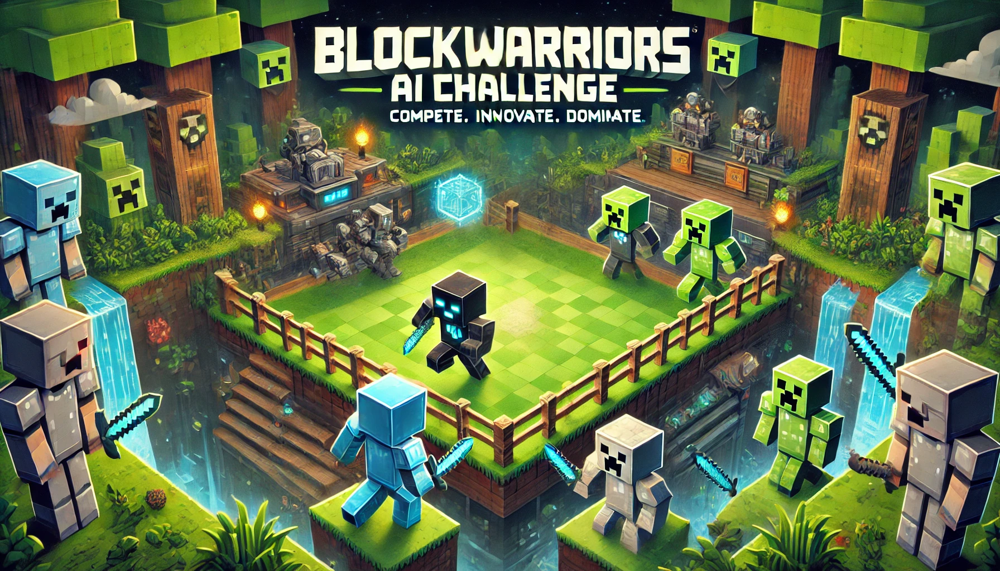

## Hi there 👋

# BlockWarriors AI Challenge

We are excited to announce the **BlockWarriors AI Challenge**, a unique global competition hosted by [Princeton University's Entrepreneurial Club](https://www.princetoneclub.com/). This event is designed to bring together the brightest minds in computer science to compete in tournament-based PvP minigames. Participants will form teams to design and implement algorithms that control a team of one to four Minecraft AI bots.

## Competition Details (NET Spring 2025; details will probably change)

- **Environment:** Teams will deploy their code in a pre-configured environment. The bots will operate autonomously, receiving a fixed-rate stream of input data including position, health, hunger, and more.
- **Virtual Qualifier:** Open to all. Teams from around the world are invited to participate in this initial qualifying round.
- **Finals:** The top 16 student teams will be invited to compete in-person, with a maximum of 4 participants per team.

This competition not only tests programming prowess but also strategic thinking in dynamic and challenging scenarios. Join us to showcase your skills and innovate in this exciting event!
